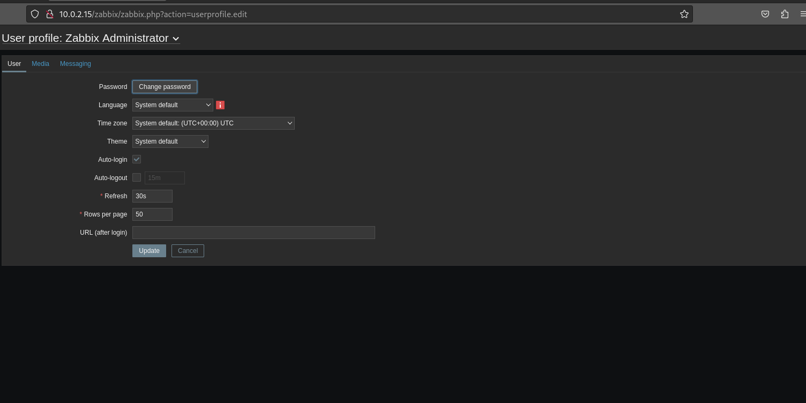
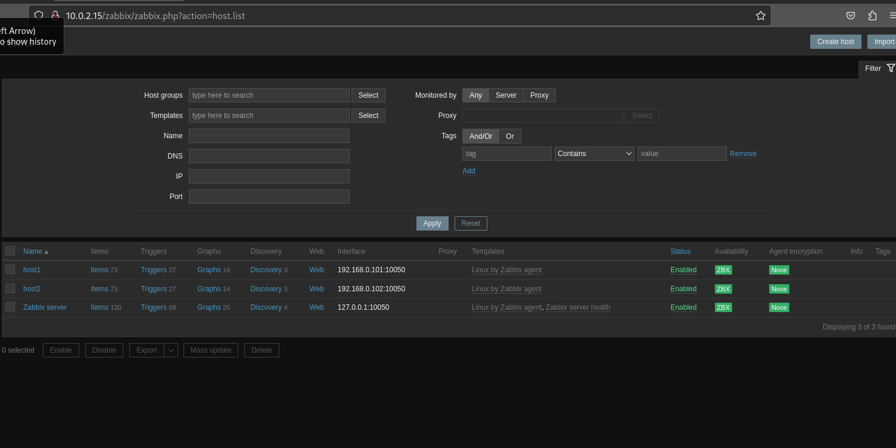
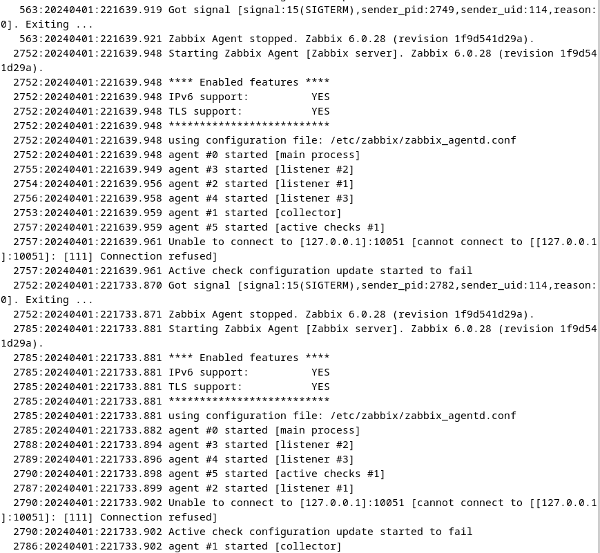
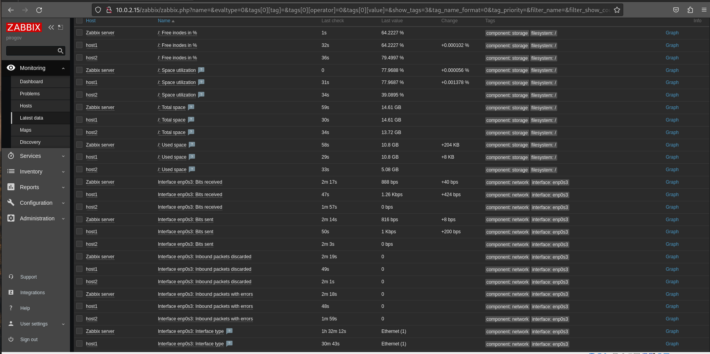

# «Система мониторинга Zabbix» - Pirogov Anton

###	Задание 1 



```

apt install postgres
wget https://repo.zabbix.com/zabbix/6.0/debian/pool/main/z/zabbix-release/zabbix-release_6.0-5+debian12_all.deb
dpkg -i zabbix-release_6.0-5+debian12_all.deb
apt update
apt install zabbix-server-pgsql zabbix-frontend-php php8.2-pgsql zabbix-apache-conf zabbix-sql-scripts zabbix-agent
sudo -u postgres createuser --pwprompt zabbix
sudo -u postgres createdb -O zabbix zabbix
zcat /usr/share/zabbix-sql-scripts/postgresql/server.sql.gz | sudo -u zabbix psql zabbix
DBPassword="password"
systemctl restart zabbix-server zabbix-agent apache2
systemctl enable zabbix-server zabbix-agent apache2


```

###	Задание 2





```

wget https://repo.zabbix.com/zabbix/6.0/debian/pool/main/z/zabbix-release/zabbix-release_6.0-5+debian12_all.deb
dpkg -i zabbix-release_6.0-5+debian12_all.deb
apt update
apt install zabbix-agent
systemctl restart zabbix-agent
systemctl enable zabbix-agent

```
